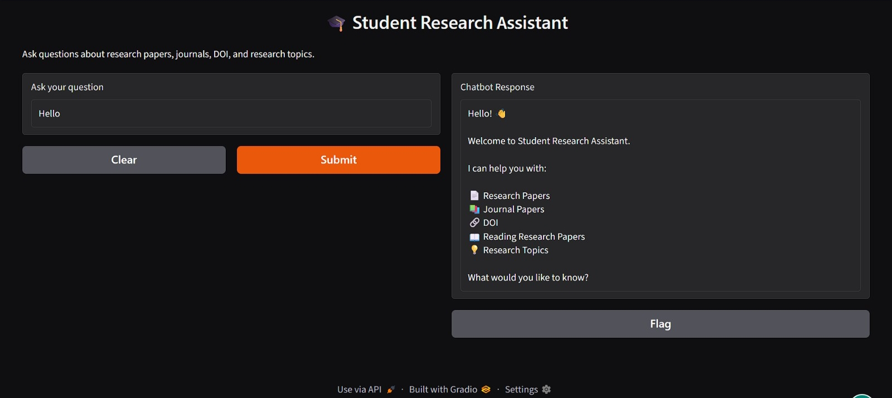
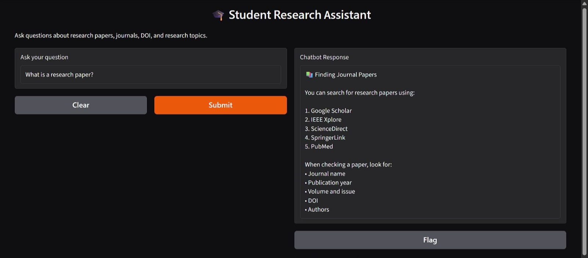
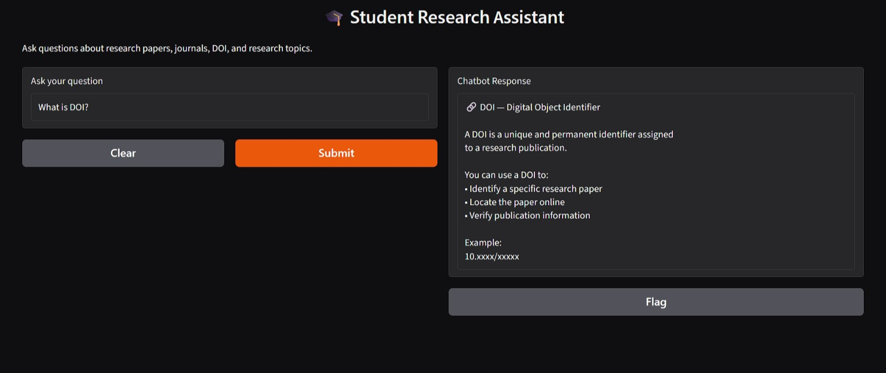
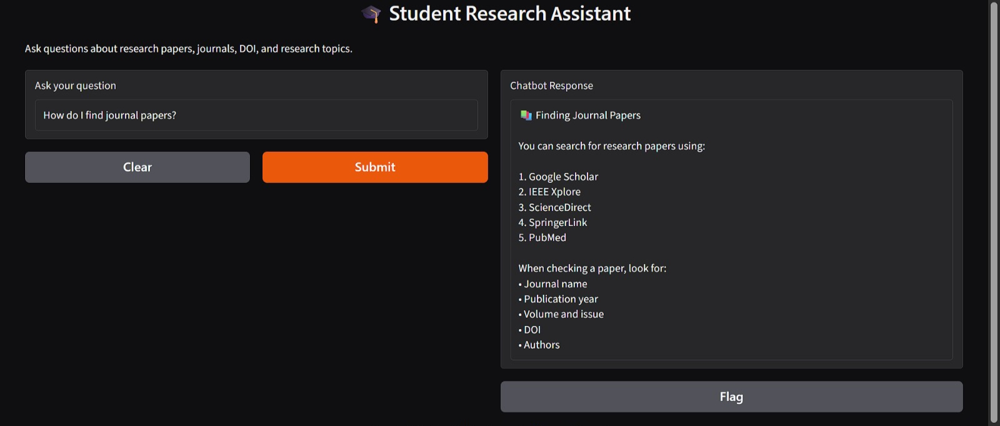
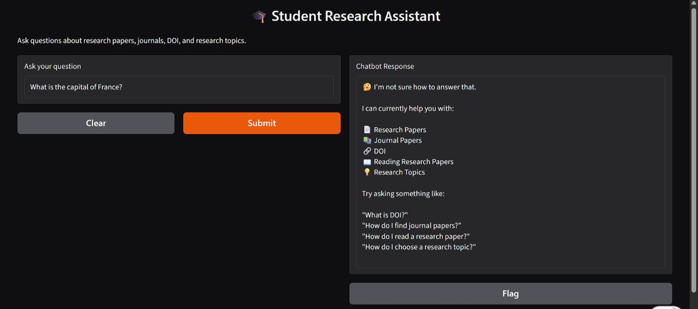

Yes. I found the exact problem. Your README has **two unclosed code blocks**:

1. The `git clone` block is missing its closing ```
2. The final ``` after the GitHub URL is unnecessary and causes the later content to be treated incorrectly.

Here is the **complete corrected `README.md`**. Replace the entire current README with this version.

````markdown
# 🎓 Student Research Assistant Chatbot

An interactive chatbot designed to help students understand basic research concepts and get guidance on research papers, journal papers, DOI, paper reading, and research topic selection.

## 🎯 Objective

The Student Research Assistant Chatbot provides quick and simple guidance to students who are beginning their research journey.

## 👥 Target Users

- Undergraduate students
- Postgraduate students
- M.Tech students
- Beginner researchers

## ✨ Features

- 👋 Greeting and welcome interaction
- 📄 Research paper explanation
- 📚 Journal paper search guidance
- 🔗 DOI explanation
- 📖 Research paper reading guidance
- 💡 Research topic selection guidance
- 🤔 Fallback response for unsupported questions

## 🛠️ Technologies Used

- Python
- Gradio
- Google Colab
- GitHub

## 💬 Example Questions

The chatbot can answer questions such as:

- What is a research paper?
- What is DOI?
- How do I find journal papers?
- How do I read a research paper?
- How do I choose a research topic?

## 🚀 How to Run

### 1. Clone the repository

```bash
git clone https://github.com/RKYEngineering/student-research-assistant-chatbot.git
````

### 2. Install the required package

```bash
pip install -r requirements.txt
```

### 3. Open the Jupyter Notebook

Open:

```text
Student_Research_Assistant_Chatbot.ipynb
```

Run the cells in order.

## 📁 Project Structure

```text
student-research-assistant-chatbot/
│
├── screenshots/
│   ├── welcome.jpg
│   ├── research-paper.jpg
│   ├── doi.jpg
│   ├── journal-papers.jpg
│   ├── reading-paper.jpg
│   └── fallback.jpg
│
├── Student_Research_Assistant_Chatbot.ipynb
├── chatbot.py
├── requirements.txt
└── README.md
```

## 📌 Project Status

Currently implemented as a rule-based chatbot using Python and Gradio.

## 🔮 Future Improvements

* Add AI/LLM-based responses
* Add PDF document question answering
* Add Retrieval-Augmented Generation (RAG)
* Add research paper summarization
* Deploy the chatbot as a permanent web application

## 📸 Chatbot Screenshots

### Welcome



### Research Paper



### DOI



### Journal Papers



### Reading a Research Paper


### Fallback Response



## 👨‍💻 Author

**RKYEngineering**

GitHub: [https://github.com/RKYEngineering](https://github.com/RKYEngineering)

```

### Do this now

1. Open **README.md → Edit**
2. **Ctrl + A**
3. Delete everything
4. Paste the corrected README above
5. Click **Commit changes**
6. Go back to the repository
7. Scroll down to the README

This time you should see **proper headings and the actual six screenshots**, not the Markdown code.

**Don't do anything else yet.** After committing, send me a screenshot of the README result.
```
